# Alembic Assembly Guide

Welcome to the assembly guide for the Alembic toolhead. 

> [!CAUTION]
> **Important Torque Notice:**
> The milled portions of this toolhead are **aluminum**—this includes the carriage, the extruder, and the mounting plate for the hotend. Fasteners going into these aluminum parts can be tightened to proper torques ~ 1.2 Nm (10.6 in-lbs).
> 
> However, **the rest of the parts are 3D-printed and SHOULD NOT be overtightened.** Stop turning as soon as the plastic begins to compress.

---

## Preparation: Tubing Bending Jig

To ensure proper airflow and alignment to the nozzle tip, the 5mm OD aluminum tubes must be bent to profiles without crimping the walls. 

A set of simple but specialized 3D-printable tools (`Bend_Tool_Base.stl` and `Bend_Tool_Lever.stl`) are provided in the project files to make this process easier:

1. Print the base and lever parts with four or more walls and high infill (40%+ infill) so they don't flex under pressure.

2. Measure the distance from tube passthrough on the lower body and the edge of the heatblock. Divide this distance by two. This is the distance you will need to insert the tube into the jig to where the bend begins.

3. Seat your straight aluminum tube firmly inside the starting channel on the **Bend Tool Base** using the previous measurement.

4. Slide the **Bend Tool Lever** over the tube and apply smooth, continuous pressure to wrap it around the jig's curve until it matches the final shape.

> [!TIP]
>
> **Bend Support:** In its current form, the ID of the aluminum tube is 3mm if you have issues with the tube deforming and blocking airflow, you can insert a <3mm rod into the tube to provide support during bending.  A great option for this are the 2.8mm plastic welding rods, which are usually easy to remove post bend.
>
> **Tool Spacing:** There should be about 5-10mm of space between the two tools when starting to bend. This avoids tool breakage and provides sufficient room for the bend to follow the curve of the tool.

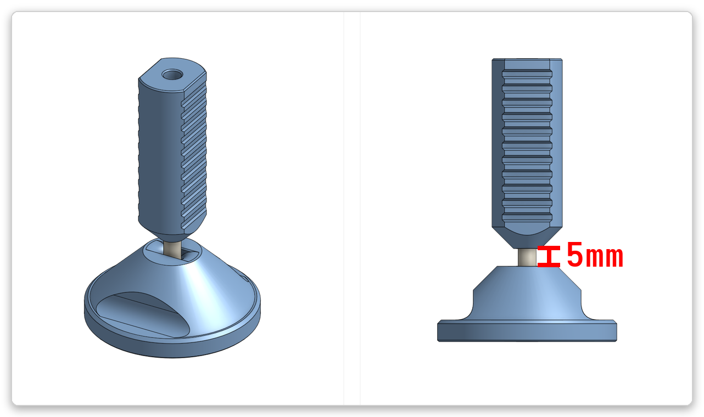 
*Fig. 1: Example of tubing bend tool layout emphasizing the initial 5mm spacing.*

---

## Preparation: Heat Set Inserts

Install the M3 heat set inserts into your printed parts and add the upper o-ring to the intake before threading the pnuematic fitting. 

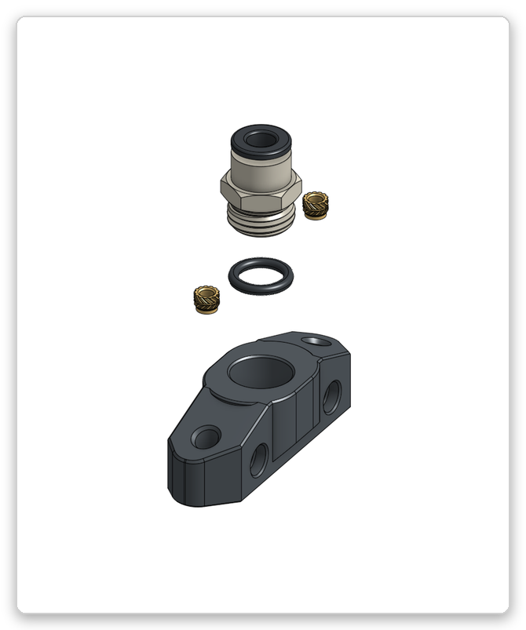 
*Fig. 2: Install (2) M3 inserts into the intake component.*

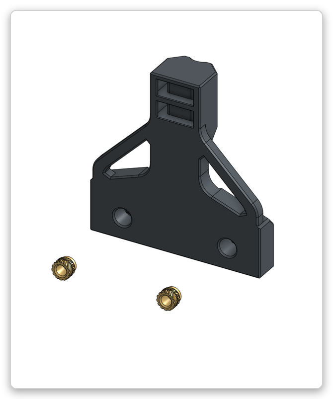 
*Fig. 3: Install (2) M3 inserts into the strain relief block.*

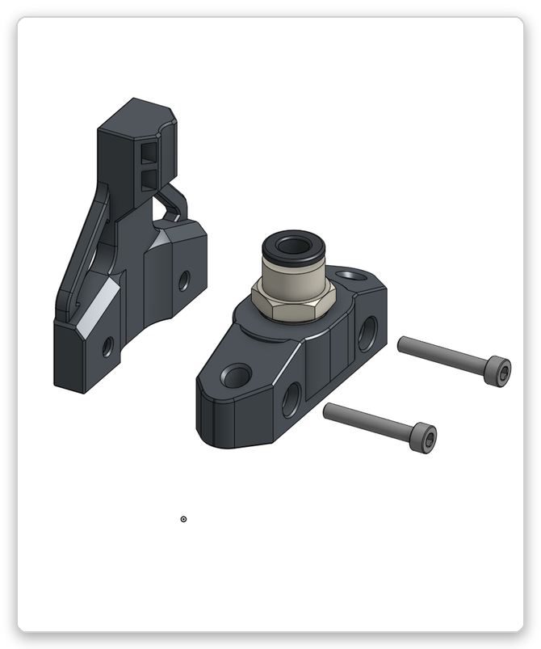 
*Fig. 4: Assemble strain relief and intake.*

---

## Step 1: Main Body and Tubing

Insert the aluminum tubes.
> [!TIP]
> 
>Due to alignment requirements, the tubes will actually rotate about 5 degrees to ensure they directly point towards the nozzle tip.   Ensure the vertice of the air path is directly under the nozzle tip, but the tubes themselves are above nozzle face level to avoid impact with prints. 

Ensure you use the O-ring to get a proper seal for the compressed air when tying the whole assembly together. 

After merging the manifold and lower body, add grub screws to lock the tubes in place. 

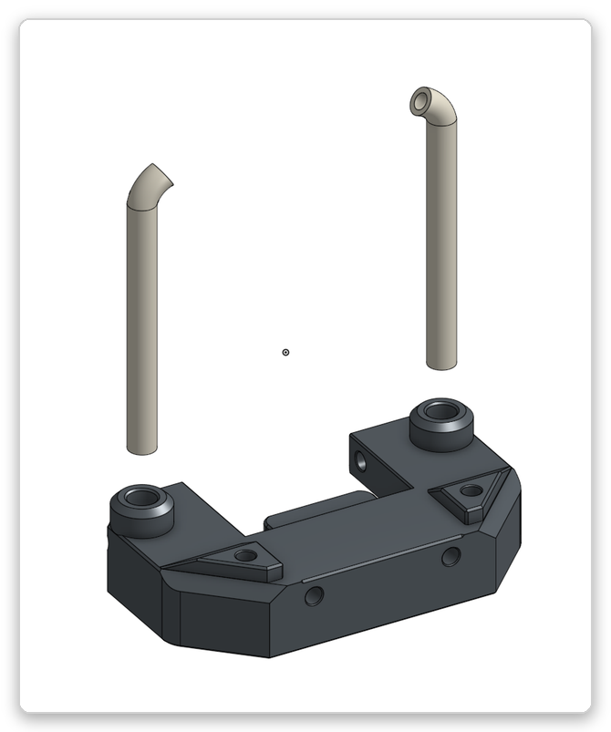 
*Fig. 5: Insert the primary tubing into the main body.*

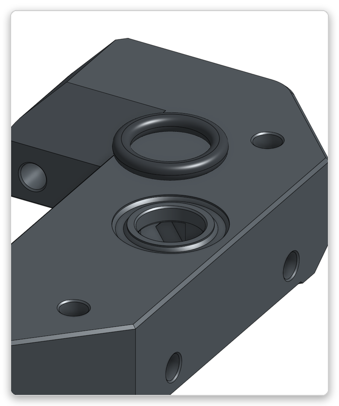 
*Fig. 6: Ensure the O-ring is properly seated for an airtight seal.*

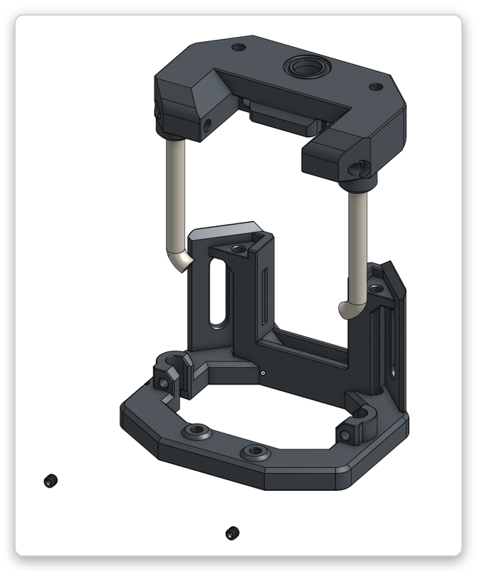 
*Fig. 7: Secure the assembly with grub screws, but remember not to crush the tubing.*

---

## Step 2: Vertical Assembly and Mounting

Now join the lower body with your toolhead carriage.

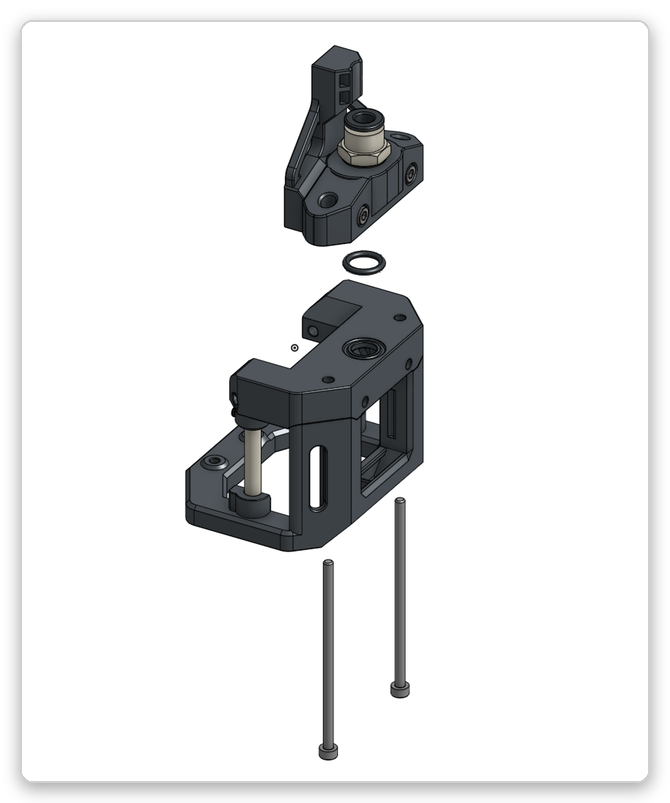 
*Fig. 8: Align the vertical bodies and tie together with the 65mm M3 BHCS screws.*
> [!TIP]
> 
>During this step you add the central O-ring between the intake and the manifold, this is easier to do by placing the manifold on the mount and setting the ring on it, before bringing the parts together.  Alignment of this o-ring is critical to ensure a proper seal.

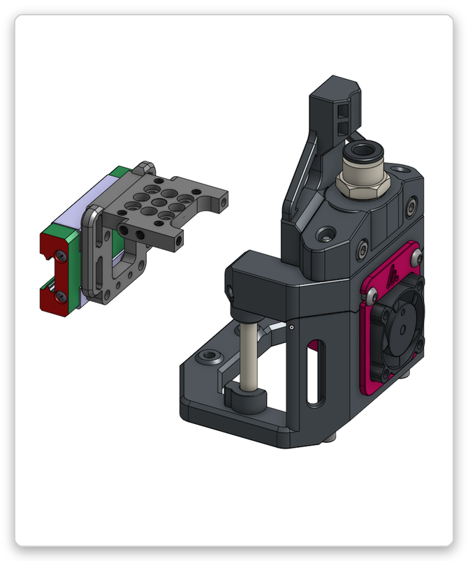 
*Fig. 9: Apply screws connecting the main Alembic body to the aluminum carriage mount.*

---

## Step 3: Hotend Baffle and 2510 Fan

The 2510 fan mounts inside the housing toolless and will snap in place. The full assembly also snaps in place but is secured with two M3 BHCS screws to the carriage. 

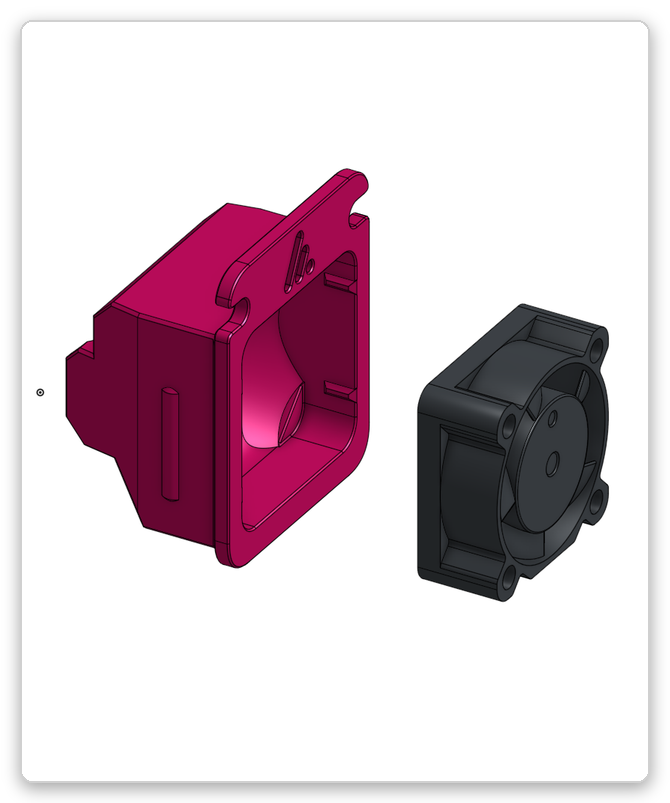 
*Fig. 10: Slide the 2510 fan into the toolless housing, then position the hotend baffle.*

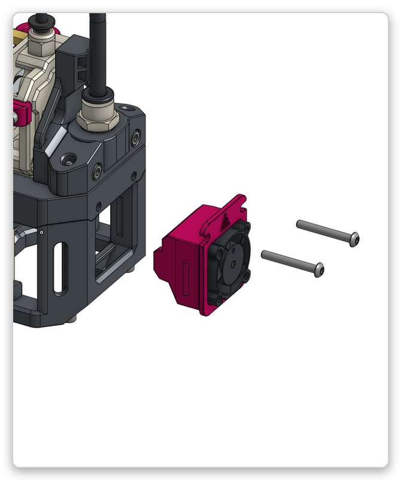 
*Fig. 11: Attach the full baffle assembly to the carriage using two M3 BHCS screws.*

---

## Step 4: Umbilical Strain Relief

Alembic utilizes an advanced umbilical featuring Chainflex (for CAN), a pneumatic tube, and a PTFE filament path. While there is strain relief for these other components, the primary relief is provided by this assembly and fastening the entire umbilical package together.

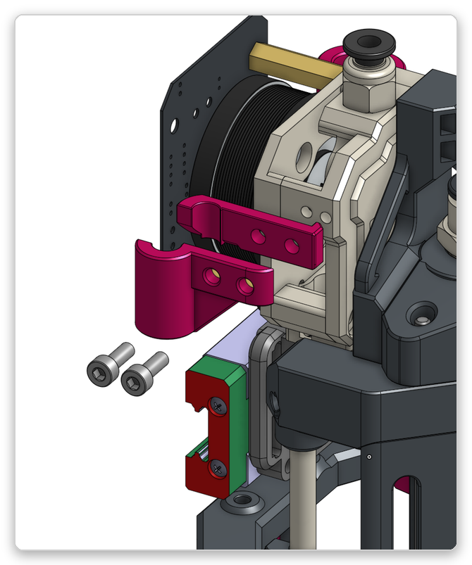 
*Fig. 12: Attach the chainflex strain relief.*

---

## Optional: BDsensor Installation

If you are using a BDsensor, install the retainer and clamp. A 0.6mm shim is provided if your hotend-to-probe offset needs adjustment.

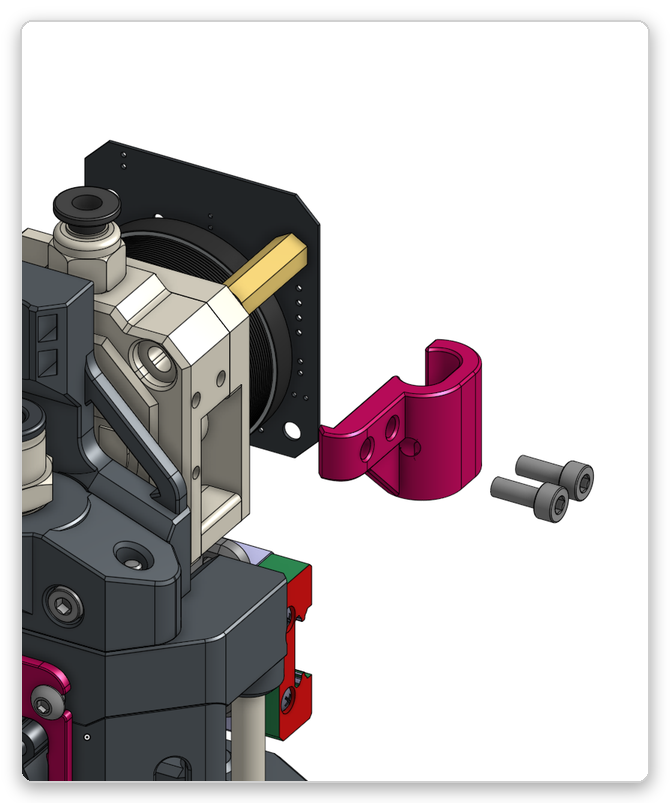 
*Fig. 13: Attach the BDsensor along with the necessary shims/clamps.*

---

### End of Assembly
The Alembic toolhead is now assembled.
