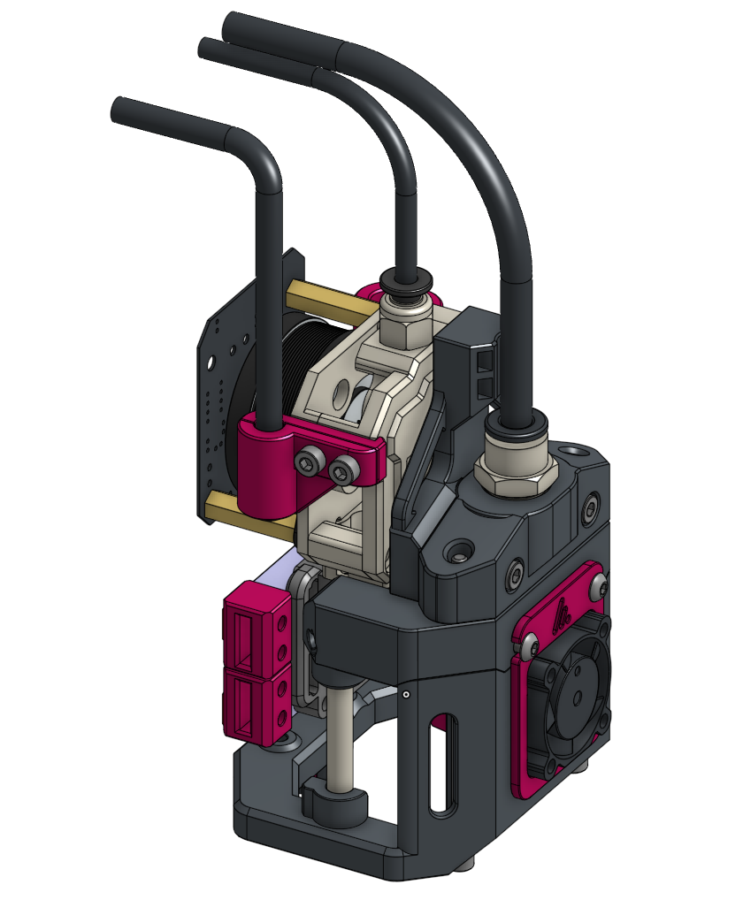
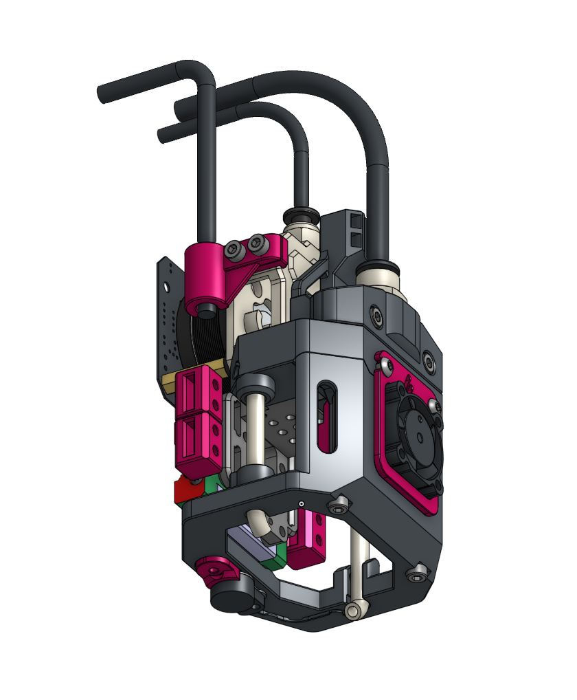
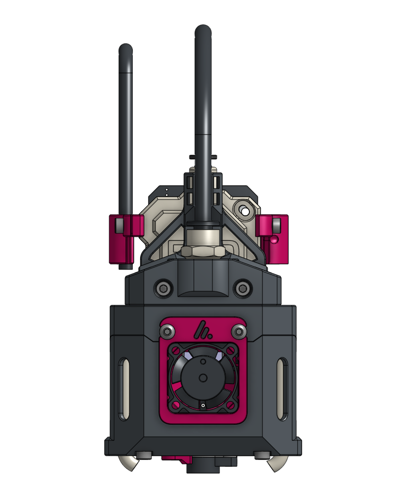

# 🧪 Alembic Toolhead

A highly specialized, ultra-lightweight toolhead designed for the Alchemical-3D ecosystem and A3DP gantry kits. Alembic replaces bulky fans with a rigid, compressed-air cooling architecture.  This toolhead is currently in the Alpha phase of development with working models.  As this toolhead moves towards Beta phase, builders can expect changes, some of which may require additional parts if upgrades are performed.

  
  &nbsp;
  

**[Bill of Materials](BOM.md)** &nbsp;•&nbsp; **[Assembly Guide](Assembly_Guide.md)** &nbsp;•&nbsp; **[Print Settings](Print_Settings.md)**

 

---

## 🌬️ The Philosophy of Alembic

Alembic differentiates itself by dropping traditional bulky 4010 or 5015 part cooling fans entirely. Instead, it utilizes remote compressed air delivered through a pneumatic tube for high-performance part cooling. 

By integrating aluminum tubing directly into the structural integrity of the carriage, Alembic achieves a design that is incredibly lightweight, surprisingly rigid, and maximally compact—offering unobstructed visibility of the nozzle during layering.

> [!NOTE]
> **Sledgehammer vs. Scalpel** 
> *"While traditional systems focus on brute-forcing CFM to wash the area with ambient cooling, Alembic focuses on exact air placement and extreme air speed to achieve superior results. Where CPAP configs are the sledgehammer... Alembic is the scalpel."*

## ✨ Key Specifications & Features

- **Primary Extruder Support:** Initial geometry tailored for the **A3DP FXD**, but is being adopted for a wide range of support.
- **Standard Hotend:** Pre-configured for the **Takoto Hotend** but is being adopted for a wide range of support.
- **Part Cooling:** High-speed compressed air via a `6mm OD x 4mm ID` pneumatic tube pipeline. 
- **Hotend Cooling:** Powered efficiently by a single lightweight **2510 fan** *(for now...)*.
- **Umbilical Management:** Features dedicated, secure routing channels for **Chainflex (CAN/USB wiring)**, the primary pneumatic airline, and the PTFE filament tube.

---

## 📚 Documentation Index

Everything you need to successfully replicate Alembic on your own machine:

| Category | Description |
| :--- | :--- |
| 📋 **[Bill of Materials (BOM)](BOM.md)** | The comprehensive checklist of printed parts, heat sets, hardware, and pneumatics needed. |
| 🛠️ **[Assembly Guide](Assembly_Guide.md)** | A fully-illustrated, step-by-step mastercloth for putting the Alembic together safely. |
| ⚙️ **[Print Settings](Print_Settings.md)** | Essential slicer configurations, material recommendations, and orientation rules. |

---

> [!NOTE]
> **Pnuematics** 
> *"This toolhead uses pressurized air, it is not the kind you think of filling up tires or tools. The pumps used are more like a fish tank or medical equipment pumps.   It can be built and ran quietly, without the noise many people expect to hear from such systems.  There is another project from Alchemical-3D called "Pnuema" in development which will solve these and other concerns in a professional and quiet package.  When this project is ready, it will also be found in this github.   In the mean time, you can use other pumps and systems you might find attached to other Berd Air solutions*  

---

## 📸 Quick Glimpse

  

